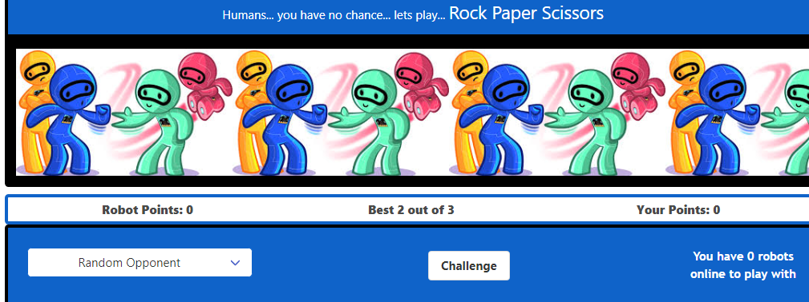
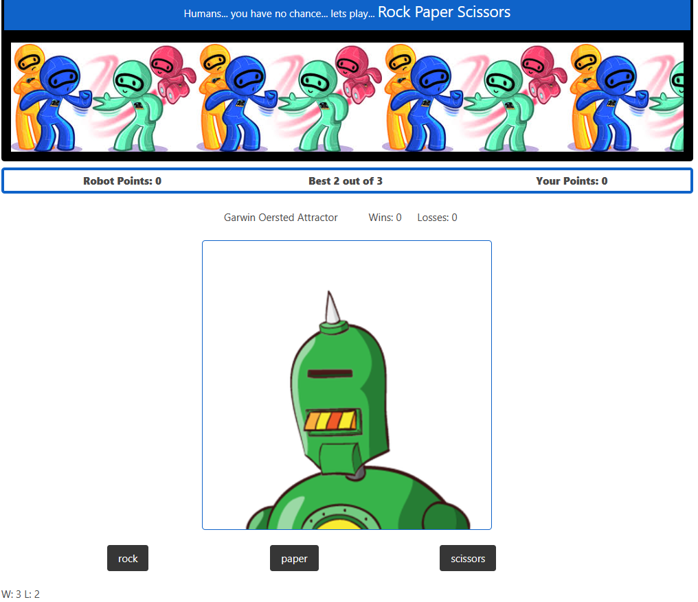

Title Name:
# Robotic Moves Brings You Rock Paper Scissors

## What can be done to cure boredom?
Real world problem (boredom) needs an other wordly solution!
Rock, paper scissors is a great game, but it requires an opponent!
Send a signal to space and find the latest in interactive three-choice AI!

##Features
I can challenge the randomly selected robots to a best two out of three games wins match.
Localstorage is used to track records.
The game features a rematch button or you can challenge a new robot.
The list of robots is randomly selected from the RoboHash API, and the rock paper scissors rounds are from the roboninja rock paper scissors API.
Suddenly space cadets and fellow galactic travelers merge on a quest to defeat the earthly blahs.

[link to gitHub  deployment ](https://stanjosh.github.io/bootcamp-project-1/)

