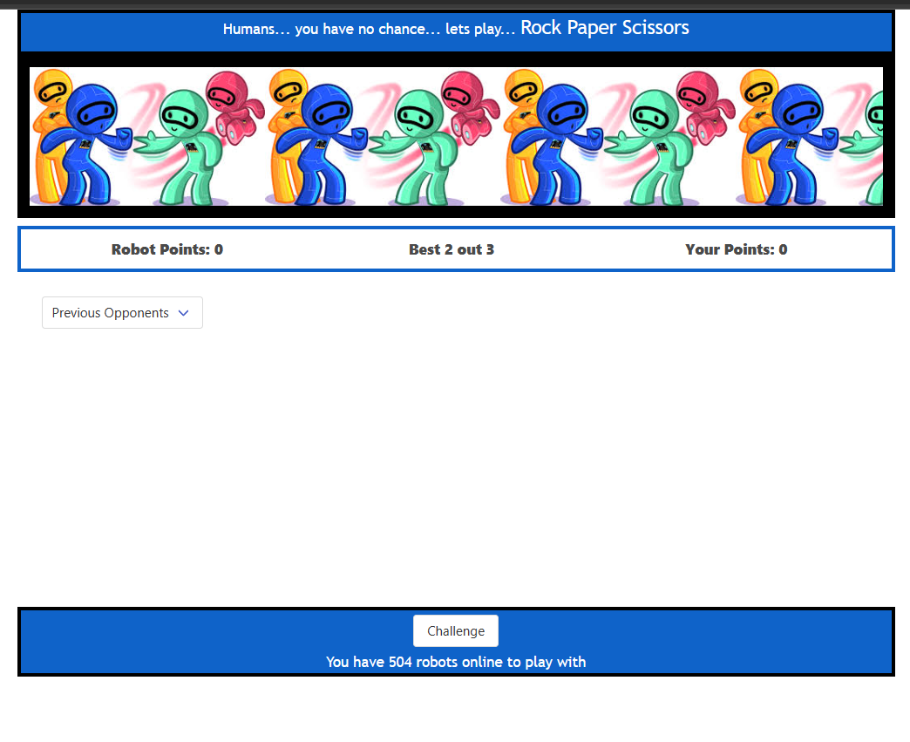

## Description 
We have created an application to alliviate boredom, or provide an extraterrestrial friend  
# bootcamp-project-1
Bootcamp Project
Project 1 Interactive Front-End Application:

Real World Problem : What Can Be done to Quit Boredom?
Solution = Rock Paper Scissors
When I come home and weather is bad I need something to do.
I find an iteractive game called Rock Paper Scissor where I pick from a random list of opponents (robots).
I can challenge the robots to the best 2 out of three games wins match.
The game features a rematch button or you can challenge a new robot.
The list of robots is randomly selected from the RoboHash API.

[link to gitHub  deployment ](https://stanjosh.github.io/bootcamp-project-1/)

